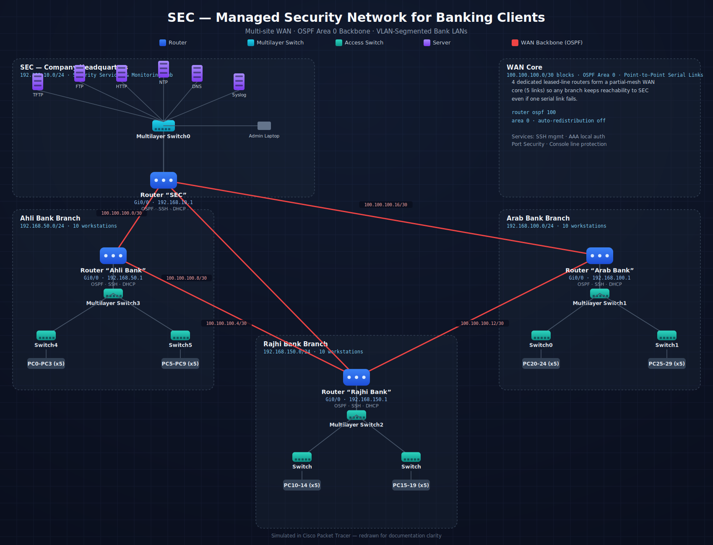

# SEC — Secure Network Infrastructure for a Bank Security Service Provider


A multi-site enterprise network design built and simulated in **Cisco Packet Tracer**, modeling a company (**SEC**) that delivers managed security and monitoring services to three banking clients: **Ahli Bank**, **Arab Bank**, and **Rajhi Bank**.

The design focuses on the concerns that matter most for financial-sector connectivity: segmented LANs, a resilient routed WAN core, centralized monitoring services, and hardened device access.

<p align="center">
  
</p>

<p align="center"><em>Click the diagram (or open <code>network-topology.svg</code> directly) to view it full-size — it's vector-based, so it stays sharp at any zoom level.</em></p>

---

## 🏗️ Architecture Overview

| Site | Role | Subnet | Key Devices |
|---|---|---|---|
| **SEC HQ** | Security operations & monitoring center | `192.168.10.0/24` | 1 Router, 1 Multilayer Switch, 6 Servers, 1 Admin Laptop |
| **Ahli Bank** | Client branch | `192.168.50.0/24` | 1 Router, 1 Multilayer Switch, 2 Access Switches, 10 PCs |
| **Arab Bank** | Client branch | `192.168.100.0/24` | 1 Router, 1 Multilayer Switch, 2 Access Switches, 10 PCs |
| **Rajhi Bank** | Client branch | `192.168.150.0/24` | 1 Router, 1 Multilayer Switch, 2 Access Switches, 10 PCs |

The four sites are tied together over a **partial-mesh WAN** of five point-to-point serial links (`/30` subnets), so SEC keeps reachability to every branch even if a single link goes down — with **OSPF (Area 0)** handling dynamic routing across the whole backbone.

---

## 🔐 Security Implementation

- **AAA + local authentication** — `aaa new-model` with a local user database backs every management session.
- **SSH v2 for remote management** — Telnet is disabled; all device administration goes over encrypted SSH sessions.
- **Port Security** — access-layer switch ports restrict connected MAC addresses to prevent rogue devices from joining the LAN.
- **Console line hardening** — line console access requires authentication and enforces session timeouts.
- **VLAN segmentation** — traffic is separated at the access layer (802.1Q tagging/trunking) to isolate host groups and reduce the attack surface.
- **Centralized Syslog** — all routers forward logs to a Syslog server at SEC HQ for auditing and incident response.
- **NTP with authentication** — MD5-authenticated NTP keeps clocks synchronized across devices, which is critical for reliable log correlation.

---

## 🌐 Routing & Services

| Service | Purpose |
|---|---|
| **OSPF (Area 0)** | Dynamic routing across the WAN backbone and all site subnets |
| **DHCP** | Automatic IP assignment per-site, with reserved ranges for infrastructure |
| **DNS** | Hostname resolution for internal servers and clients |
| **NTP** | Authenticated time synchronization |
| **Syslog** | Centralized event logging at SEC HQ |
| **TFTP / FTP / HTTP** | Configuration backup, file transfer, and internal web services hosted at SEC HQ |

### Example configuration (Router SEC — OSPF)
```
router ospf 100
 log-adjacency-changes
 network 192.168.10.0 0.0.0.255 area 0
 network 100.100.100.0 0.0.0.3 area 0
 network 100.100.100.8 0.0.0.3 area 0
 network 100.100.100.16 0.0.0.3 area 0
```

### Example configuration (SSH access)
```
ip domain-name cisco.com
ip ssh version 2
line vty 0 4
 login authentication default
 transport input ssh
```

---

## 📋 IP Addressing Table

| Device | Interface | IP Address | Subnet Mask |
|---|---|---|---|
| Router SEC | Gig0/0 | 192.168.10.1 | 255.255.255.0 |
| Router SEC | Se0/0/0 | 100.100.100.2 | 255.255.255.252 |
| Router SEC | Se0/0/1 | 100.100.100.10 | 255.255.255.252 |
| Router SEC | Se0/1/1 | 100.100.100.18 | 255.255.255.252 |
| Router Ahli Bank | Gig0/0 | 192.168.50.1 | 255.255.255.0 |
| Router Ahli Bank | Se0/0/0 | 100.100.100.1 | 255.255.255.252 |
| Router Ahli Bank | Se0/1/0 | 100.100.100.5 | 255.255.255.252 |
| Router Arab Bank | Gig0/0 | 192.168.100.1 | 255.255.255.0 |
| Router Arab Bank | Se0/0/0 | 100.100.100.14 | 255.255.255.252 |
| Router Arab Bank | Se0/1/1 | 100.100.100.17 | 255.255.255.252 |
| Router Rajhi Bank | Gig0/0 | 192.168.150.1 | 255.255.255.0 |
| Router Rajhi Bank | Se0/0/0 | 100.100.100.13 | 255.255.255.252 |
| Router Rajhi Bank | Se0/0/1 | 100.100.100.9 | 255.255.255.252 |
| Router Rajhi Bank | Se0/1/0 | 100.100.100.6 | 255.255.255.252 |

---

## ✅ Testing & Validation

End-to-end reachability was validated with ICMP tests between every pair of sites, plus interactive ping tests from client hosts.

| Source | Destination | Result |
|---|---|---|
| SEC | Arab Bank | ✅ Successful |
| SEC | Ahli Bank | ✅ Successful |
| SEC | Rajhi Bank | ✅ Successful |
| Ahli Bank | Rajhi Bank | ✅ Successful |
| Ahli Bank | Arab Bank | ✅ Successful |
| Arab Bank | Ahli Bank | ✅ Successful |
| Arab Bank | Rajhi Bank | ✅ Successful |
| Rajhi Bank | Arab Bank | ✅ Successful |
| Rajhi Bank | Ahli Bank | ✅ Successful |

All four sites achieved full mutual reachability across the OSPF backbone, confirming that routing, addressing, and access-layer configuration were all working as designed.

---

## 🧰 Tools Used

- **Cisco Packet Tracer** — network design & simulation
- **Cisco IOS** — routing (OSPF), DHCP, SSH, AAA, Syslog, NTP configuration

---

## 📁 Repository Contents

```
├── README.md                      → this file
├── network-topology.svg           → full network diagram
├── Project_Network_SEC.pkt        → Packet Tracer source file
├── LICENSE                        → MIT license
└── .gitignore                     → ignores Packet Tracer temp/backup files
```

## 📄 License

This project is released under the [MIT License](LICENSE).
